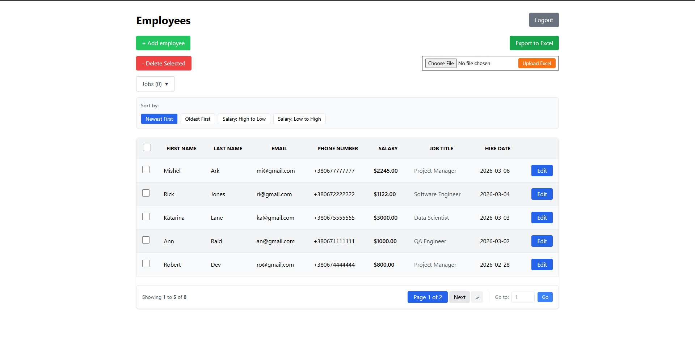
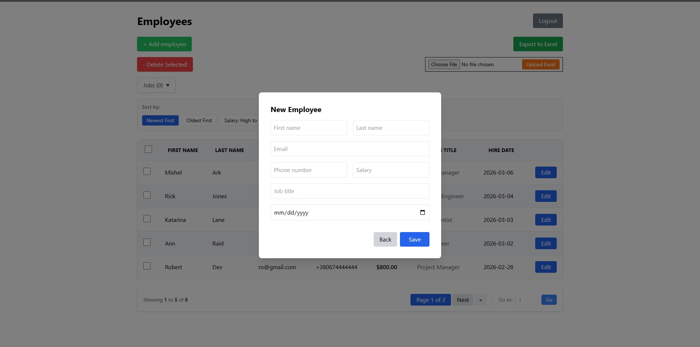
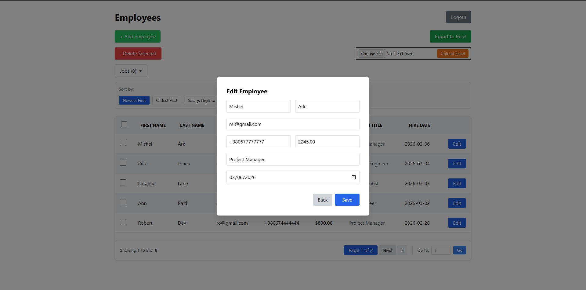
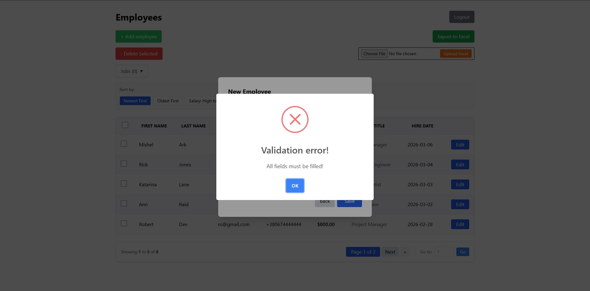
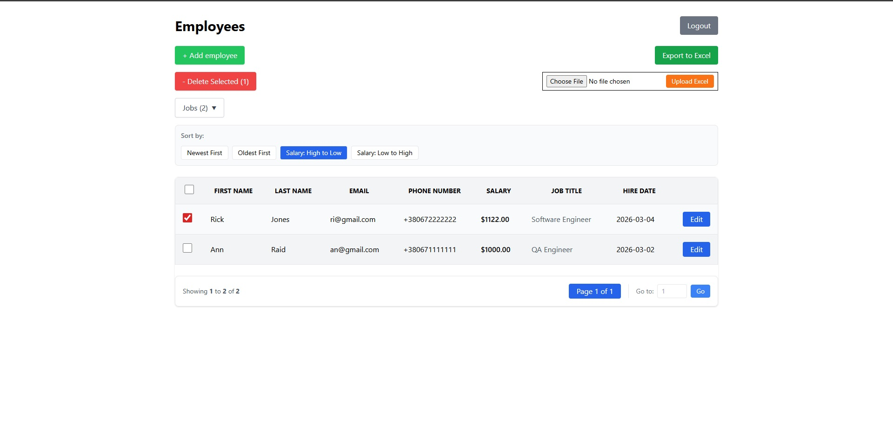
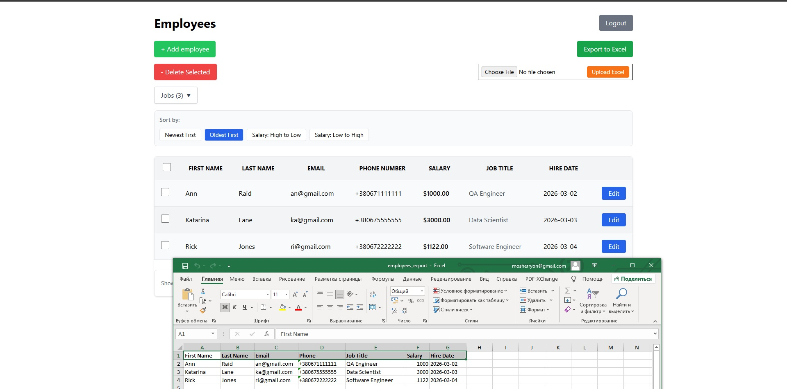

# Employee Management System (CRUD)

A fully functional web-based Employee Management System developed as a technical assessment. This application features robust CRUD operations, advanced filtering, and seamless Excel integration, providing a professional interface for HR data management.

## Key Features

- **Secure Authentication:** Protected administrative login session.
- **Data Management:** Complete CRUD (Create, Read, Update, Delete) cycle handled via AJAX and PDO.
- **Persistent Selection:** Intelligent pagination that remembers selected checkboxes across different pages using `localStorage`.
- **Advanced Filtering & Sorting:** \* Dynamic "Job Title" multi-filter (select one or more professions).
  - Multi-criteria sorting (Salary, Hire Date) that preserves active filters.
- **Excel Integration (PhpSpreadsheet):**
  - **Smart Export:** Downloads the current filtered/sorted view into `.xlsx` while maintaining correct phone number formatting.
  - **Smart Import:** Uploads Excel files and performs an "upsert" (inserts new records or updates existing ones based on a Unique Email constraint).
- **UX/UI:** Responsive design built with **Tailwind CSS** and interactive notifications via **SweetAlert2**.

## Project Walkthrough

### 1. Dashboard Overview

The main interface displaying the employee list, pagination controls, and primary action buttons.


### 2. Administrator Authentication

Secure login portal for system access control.


### 3. Employee Management (Add/Edit)

Streamlined modal forms for entering and updating employee records.



### 4. Client-Side Validation

Real-time feedback and error handling using regular expressions to ensure data integrity.


### 5. Multi-Filtering & Batch Actions

Demonstration of the dynamic Job Filter and the persistent selection logic for bulk deletion.


### 6. Excel Export Accuracy

Sample of the exported file showing perfectly formatted data, including long phone numbers and dates.


## Tech Stack

- **Backend:** PHP 8.x, PDO (MySQL)
- **Frontend:** Tailwind CSS, JavaScript (ES6+)
- **Libraries:**
  -  [PhpSpreadsheet](https://github.com/PHPOffice/PhpSpreadsheet) - High-performance Excel processing.
  - [SweetAlert2](https://sweetalert2.github.io/) - Premium popup notifications.
- **Database:** MySQL with Unique Index constraints for data synchronization.

## Installation & Setup

1.  **Clone the repository** to your local server.
2.  **Install dependencies** via Composer:
    ```bash
    composer require phpoffice/phpspreadsheet
    ```
3.  **Database Setup:**
    - Import the provided `database.sql` into your MySQL server.
    - Update the connection credentials in `db.php`.
4.  **Login Credentials:**
    - Default Admin: `admin@example.com` / `password123` (or as specified in your DB).
